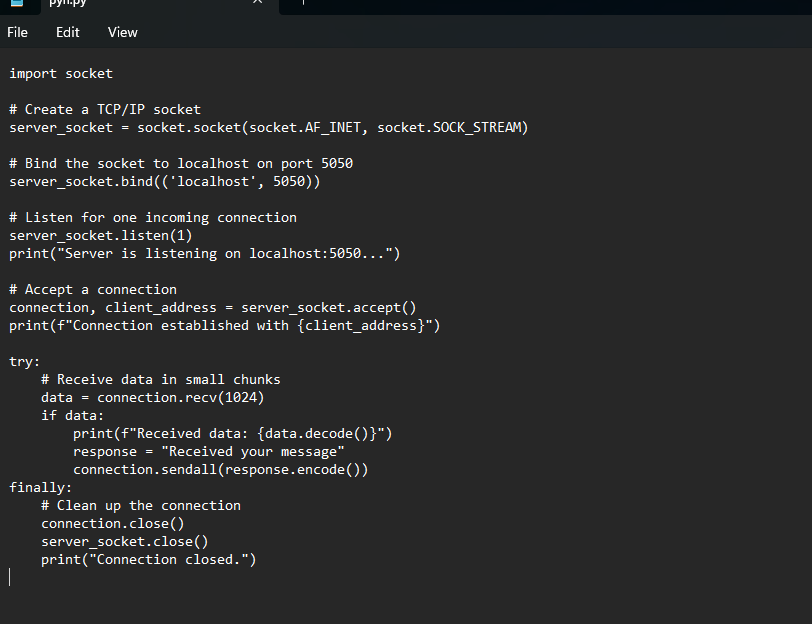

# Network_fundamental_task3

# Python TCP Server

This is a simple example of a TCP server written in Python. The server listens on `localhost:5050`, accepts one connection, and sends the message `'Received your message'` when it receives data from the client.

## 🧰 Requirements

- Python 3

## 🚀 Getting Started

### 1. Create `tcp_server.py`

Create a file named `tcp_server.py` and paste the following code:

```python
import socket

# Create a TCP/IP socket
server_socket = socket.socket(socket.AF_INET, socket.SOCK_STREAM)

# Bind the socket to localhost on port 5050
server_socket.bind(('localhost', 5050))

# Listen for one incoming connection
server_socket.listen(1)
print("Server is listening on localhost:5050...")

# Accept a connection
connection, client_address = server_socket.accept()
print(f"Connection established with {client_address}")

try:
    # Receive data in small chunks
    data = connection.recv(1024)
    if data:
        print(f"Received data: {data.decode()}")
        response = "Received your message"
        connection.sendall(response.encode())
finally:
    # Clean up the connection
    connection.close()
    server_socket.close()
    print("Connection closed.")
